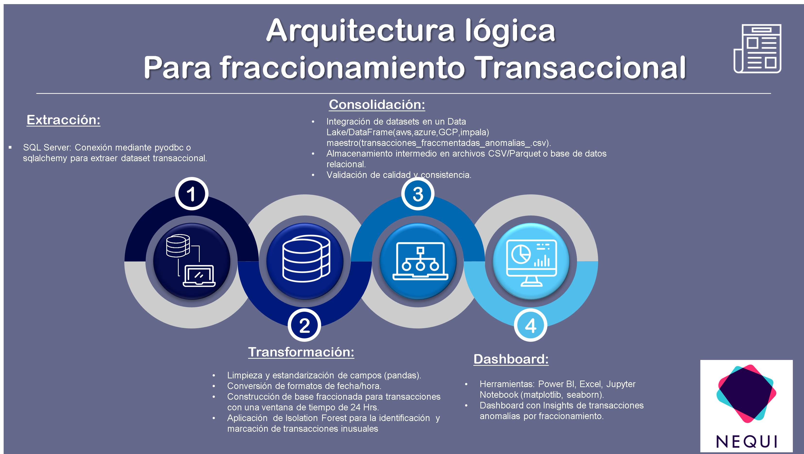

# **Prueba Técnica - Científico de Datos Nequi**
## Prueba Analítica: Prueba Técnica
### Científico de Datos:

* Daniel Felipe Pérez Grajales . dfperezg@unal.edu.co 

  

---
 

**Objetivo:**
El objetivo de la prueba es idear una solución para identificar transacciones que evidencian un comportamiento de Mala Práctica Transaccional, empleando un producto de datos. Adicional, describir la solución y detallar cómo incorporar el producto de datos en un marco operativo. 
 
Se entiende como una Mala Práctica Transaccional, un comportamiento donde se evidencia un uso de los canales mal intencionado; para la prueba técnica nos centraremos en la práctica de Fraccionamiento  Transaccional,  esta  mala  práctica  consiste  en  fraccionar  una transacción  en un número  mayor  de  transacciones  con  menor  monto  que  agrupadas  suman  el  valor  de  la transacción  original.  Estas  transacciones  se  caracterizan  por  estar  en  una  misma  ventana  de tiempo que suele ser 24 horas y tienen como origen o destino la misma cuenta o cliente. 
 
Con la solución de este reto, esperamos conocer las habilidades de modelado estadístico, matemático,  heurístico  y/o  analítico  en  general  que  a  lo  largo  de  su  vida  académica  y profesional han desarrollado. 
 
Valoramos mucho la habilidad que tengan de detallar los hallazgos dados a partir de las diferentes etapas del análisis. 

### Entregable

Archivo Jupyter Notebook (Prueba_Tecnica_Nequi_DsC_DFPG.ipynb) funcional con el siguiente:

**Paso 1: Alcance del proyecto.** 

Se llevo a cabo un ETL con la construcción de la base fracccionada de las transacciones con una ventana de 24 horas, donde se identifico por cuenta y dia cuantas transacciones sehacen en la ventana de tiempo de 24 horas y los montos por hora, monto total en 24 horas.

### **Paso 2: Explorar y evaluar los datos, el EDA.**
Se hace un analisis estadistico del comportamiento de las varibles 'mount_trans_24_hrs','cant_trans_24_hrs'
 
### **Paso 3: Definir el modelo analítico.**
 
1. A partir de la base de conocimiento df_fraccio_fn, se planteo aplicar técnicas no supervisadas de detección de anomalias como:

* Isolation Forest
* Cluster based anomaly detection (K-mean)
* Repartition of data into categories then Gaussian/Elliptic Enveloppe on each categories separately
* Markov Chain
* One class SVM
* RNN (comparison between prediction and reality). 

Para darle solución al objetivo se aplico la tecnica no supervisada de **Isolation Forest** para identificar el umbra de a partir de que 'mount_trans_24_hrs' y 'cant_trans_24_hrs' se considera una anomalia por Fraccionamiento.

2. Proponga con qué frecuencia deben actualizarse los datos y por qué.

para tener alertas tempranas y poner a producción el modelo se recomienda hacerlo cada 24 horas.

3. Diseñar una arquitectura ideal y los recursos necesarios para desplegar su propuesta (Opcional). 

R=/ El campo flag_fraccionamiento indica si la transacción hace parte de un posible fraccionamiento.
Puedes exportar el resultado o integrarlo en un dashboard, API, o proceso batch.
 
**Incorporación en marco operativo**

**Batch:** Ejecutar el script diariamente para marcar transacciones sospechosas.
**Streaming:** Adaptar la lógica para sistemas en tiempo real.
**Alertas:** Integrar con sistemas de monitoreo para alertar a compliance.

 
 

 

### conclusiones:

* Se crea base de conocimiento df_fraccio_fn, donde se crean variables como 'mount_trans_24_hrs','cant_trans_24_hrs' que concentran el fraccionamiento de las transacciones en una ventana de 24 horas.

* Aplicando Metodos de Detección de Anomalias como IsolationForest y una contamination = 0.01, se Identifica las transacciones fracturadas en una ventana de tiempo de 24 horas inusuales, donde se ve un perfil inusual y se define unos umbrales para considerar la transacciones fraccionada en una ventana de tiempo de 24 horas, cantidad de transacciones mayores o iguales a 6 y un monto total mayor o igual a $2185.6.